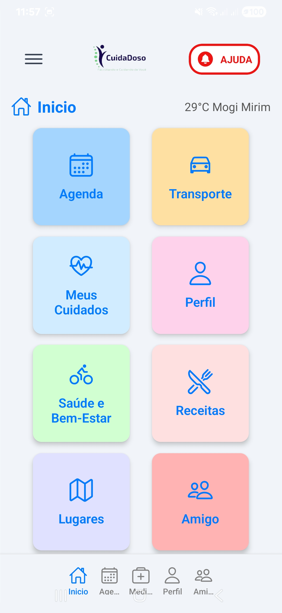
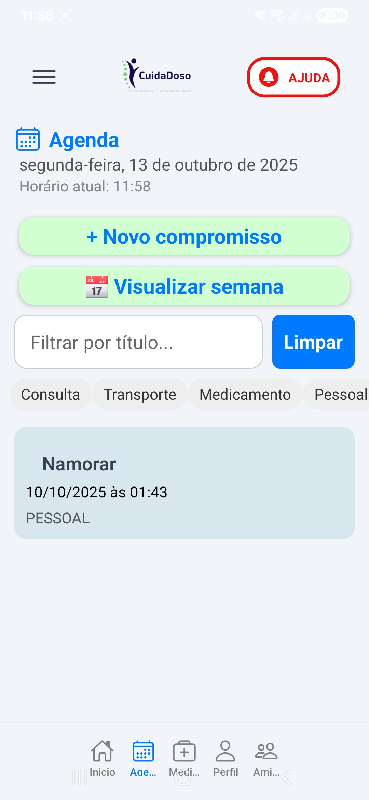

# Bem Vindo ao app CuidaDoso

## 🚀 Tecnologias Principais

---

## 🌐 APIs e Serviços Integrados

---

## 📲 Demonstração do App

  
*Tela inicial com cards de funcionalidades.*

  
*Agenda de consultas e exercícios.*

  
*Agendamento de transporte.*

  
*Controle de medicamentos.*

---

## 📂 Estrutura do Projeto

CuidaDoso/
├─ .gitignore  
├─ App.js  
├─ package.json  
├─ app/  
│ ├─ (auth)/ # Login e cadastro  
│ ├─ (main)/ # Telas principais  
│ └─ _layout.js # Layout com Tabs  
├─ assets/  
│ ├─ images/ # Logos e imagens  
│ └─ gifs/ # GIFs animados das telas  
├─ components/ # Header e botões  
├─ hooks/ # useAuth, useWeather  
├─ services/ # APIs externas  
├─ config/ # firebaseConfig.js  
└─ README.md  

---

## ⚡ Funcionalidades

- Tela inicial dinâmica com **cards de navegação**.  
- **Botão de pânico** acionando chamada direta.  
- Previsão do tempo baseada na localização.  
- Cadastro de usuários:  
  - Principal (idoso)  
  - Amigo (usuário secundário)  
  - Cooperadores (clínicas/motoristas)  
- Agenda de consultas e exercícios.  
- Agendamento de transporte.  
- Controle de medicamentos com alertas.  
- Seções de atividades, receitas e lugares recomendados.  
- Preparado para integração com APIs externas (Google Agenda, GPT para receitas).  

---

## 🎨 Design e Usabilidade

- Interface **amigável para idosos**.  
- Cores suaves e botões grandes:  
  - Fundo: `#f1f4f8`  
  - Botões principais: `#d2ecff`  
  - Botão de pânico: `#e90404`  
- Ícones claros com **Ionicons**.  

---

## 🚀 Tecnologias

- **React Native**  
- **Expo Router**  
- **Firebase Authentication**  
- **Expo Location**  
- **OpenWeatherMap API**  
- **React Native Vector Icons (Ionicons)**  

---

## ⚙️ Instalação

1. Clone o repositório:

git clone https://github.com/LuizGuidini/CuidaDoso_React_Navegation.git
cd CuidaDoso_React_Navegation

---

### Instale as dependências:

npm install

 ou

yarn install

---

### Inicie o Expo:

npx expo start -c

---

### Abra o QR Code com Expo Go no seu celular.

---

## 🔑 Configuração

- **Firebase:** Crie o arquivo `config/firebaseConfig.js` com suas credenciais do Firebase.

- **API de previsão do tempo:** crie um arquivo `.env` na raiz do projeto e adicione:

OPENWEATHER_API_KEY=SUA_CHAVE_OPENWEATHERMAP

---

## 💡 Observações
Estrutura modular para manutenção e escalabilidade.

Preparado para múltiplos usuários e notificações.

Todos os recursos podem ser testados sem autenticação, para testes rápidos.

---

## 📥 Instalação no celular
Android/iOS: Baixe o Expo Go e escaneie o QR Code exibido no terminal.

Link direto: Expo Go

---

## 📝 Licença
Este projeto é open source. Pode ser usado, modificado e compartilhado livremente.
